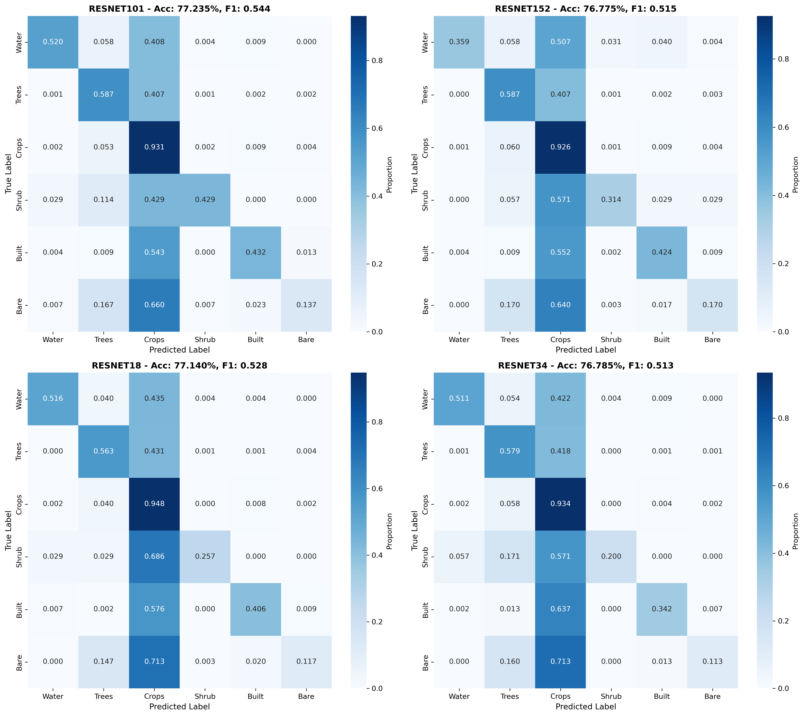
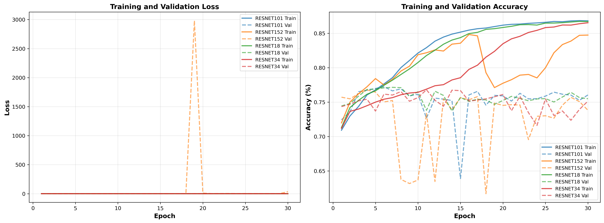
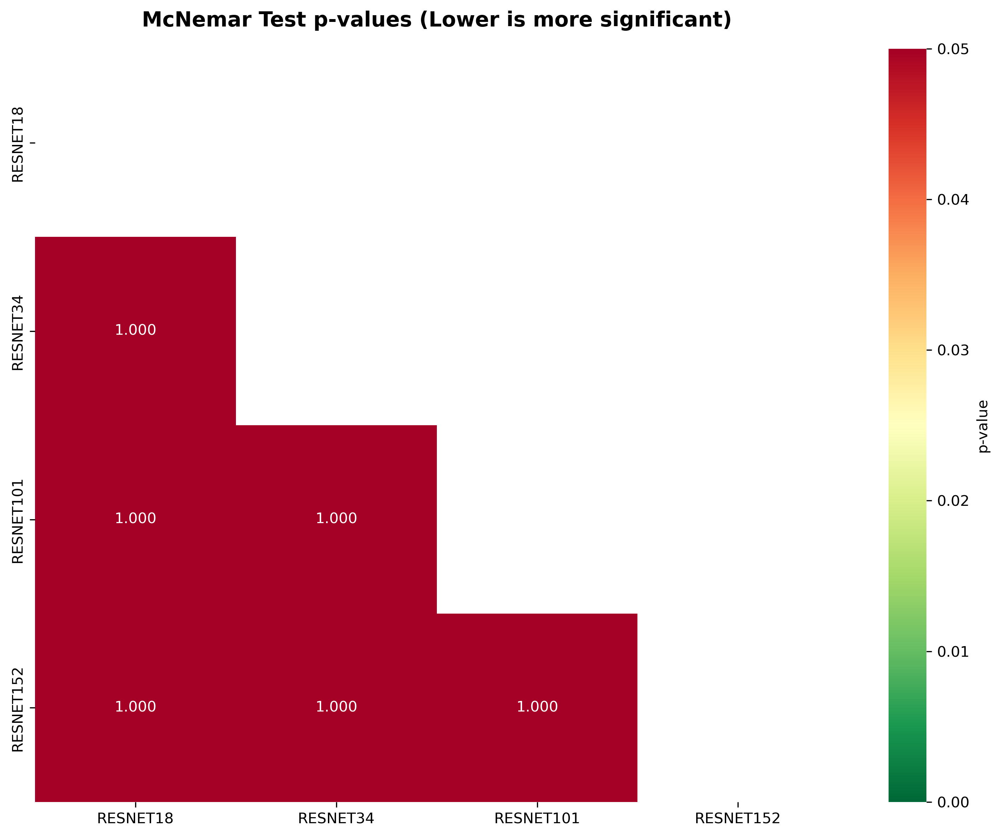

# Comparative Analysis of Deep Learning Architectures for Land Cover Classification Using Sentinel-2 Imagery: A Case Study of Jambi Province, Indonesia

**First Author^a,\*^, Second Author^b^, Third Author^b^**

^a^ *Department, University, Address, City, Postal Code, Country*

^b^ *Department, University, Address, City, Postal Code, Country*

\* *Corresponding author: email@university.ac.id*

---

## Abstract

This study evaluates five deep learning architectures for pixel-based land cover classification in Jambi Province, Sumatra, Indonesia, using multi-spectral Sentinel-2 imagery at 20-metre resolution. The input feature space comprises 23 channels constructed from 10 spectral bands and 13 derived spectral indices, including NDVI, EVI, NDWI, NDBI, and NBR. Ground truth labels were obtained from the Indonesian Ministry of Environment and Forestry (KLHK) 2024 land cover dataset covering 28,100 polygons, which were rasterised and mapped to six simplified classes: Water, Trees/Forest, Crops/Agriculture, Shrub/Scrub, Built Area, and Bare Ground. Five architectures were compared: Swin Transformer Tiny (Swin-T), ConvNeXt Tiny (ConvNeXt-T), DenseNet-121, ResNet-50, and EfficientNet-B3, all initialised with ImageNet pretrained weights and fine-tuned on 80,000 training patches of 32 by 32 pixels. Swin-T achieved the highest overall accuracy of 79.54% with an F1-macro score of 0.5644 and a Cohen's kappa of 0.587, followed by ConvNeXt-T at 79.14%, DenseNet-121 at 78.85%, ResNet-50 at 78.64%, and EfficientNet-B3 at 78.29%. McNemar's tests confirmed that Swin-T significantly outperformed all other architectures except ConvNeXt-T at the p < 0.05 level. Per-class analysis revealed that all models achieved high F1 scores for the dominant Crops class (0.839 to 0.846) but struggled with minority classes such as Bare Ground (0.207 to 0.278) and Shrub (0.174 to 0.367), reflecting the severe class imbalance inherent in tropical land cover distributions. The results demonstrate that modern transformer-based and convolution-based architectures offer modest but statistically significant improvements over traditional residual networks for tropical land cover mapping, while the persistent challenge of minority class classification warrants further investigation through advanced sampling strategies and loss function design.

**Keywords:** land cover classification, deep learning, Sentinel-2, transfer learning, Swin Transformer, ConvNeXt, Jambi Province, Indonesia

---

## I. INTRODUCTION

Accurate and up-to-date land cover maps are essential for environmental monitoring, natural resource management, and climate change assessment [1]. In tropical regions such as Sumatra, Indonesia, rapid land use change driven by palm oil expansion, logging, and urbanisation has made land cover mapping both urgent and challenging [2]. Jambi Province, located in central Sumatra, exemplifies these dynamics: its landscape spans lowland tropical forest, extensive oil palm and rubber plantations, peatland ecosystems, and growing urban centres, creating a heterogeneous classification problem that demands robust methods [3].

Satellite remote sensing provides the spatial and temporal coverage needed for large-area land cover mapping. The European Space Agency's Sentinel-2 mission delivers multi-spectral imagery at 10 to 20 metre resolution with a five-day revisit cycle, making it a primary data source for land cover studies [4]. Sentinel-2's 13 spectral bands, spanning visible, near-infrared, red edge, and shortwave infrared wavelengths, enable discrimination among vegetation types, water bodies, built-up areas, and bare surfaces [5]. Spectral indices derived from these bands, such as the Normalised Difference Vegetation Index (NDVI) and Normalised Difference Water Index (NDWI), further enhance class separability [6].

Traditional machine learning classifiers, including Random Forest and Support Vector Machines, have been widely applied to satellite image classification [7], [8]. However, these methods typically operate on individual pixels or predefined feature vectors without exploiting spatial context. Deep learning architectures, particularly Convolutional Neural Networks (CNNs), have demonstrated superior performance by learning hierarchical spatial-spectral features directly from image patches [9], [10]. Transfer learning from ImageNet pretrained models further reduces the data requirements for training deep networks on remote sensing tasks [11].

The evolution of deep learning architectures has been rapid. Residual Networks (ResNet) introduced skip connections that enabled training of very deep networks [12]. DenseNet improved feature reuse through dense connectivity patterns [13]. EfficientNet achieved state-of-the-art performance through compound scaling of network depth, width, and resolution [14]. More recently, Vision Transformers have challenged CNN dominance by applying self-attention mechanisms to image patches [15], and hybrid architectures such as the Swin Transformer incorporate hierarchical representations with shifted window attention for efficient multi-scale processing [16]. ConvNeXt revisited pure convolutional designs using modern training strategies and architectural modifications inspired by transformers [17].

Despite these advances, comparative studies of modern architectures for tropical land cover classification remain limited. Most studies focus on temperate or boreal environments [18], use coarser-resolution imagery such as Landsat [19], or compare only CNN variants without including transformer-based models [20]. Furthermore, land cover mapping in Indonesia faces specific challenges: persistent cloud cover limits usable imagery, the dominance of plantation agriculture creates spectrally similar classes, and severe class imbalance between common classes such as forest and cropland and rare classes such as bare ground and shrubland degrades classifier performance [21].

This study addresses these gaps by comparing five modern deep learning architectures for land cover classification in Jambi Province using cloud-free Sentinel-2 imagery from the 2024 dry season. The architectures span three design paradigms: traditional CNNs (ResNet-50, DenseNet-121), efficient CNNs (EfficientNet-B3, ConvNeXt-T), and vision transformers (Swin-T). All models are evaluated under identical conditions using the same input features, training protocol, and test set, enabling a fair comparison. Ground truth is derived from the official KLHK 2024 land cover dataset, providing authoritative reference data for six land cover classes. The comparison covers overall accuracy, F1 scores, Cohen's kappa, per-class precision and recall, confusion patterns, training dynamics, and statistical significance through McNemar's pairwise tests.

The remainder of this paper is organised as follows. Section II reviews related work on deep learning for land cover classification. Section III describes the study area, data sources, preprocessing pipeline, model architectures, and experimental design. Section IV presents the results and discussion. Section V concludes with recommendations for future work.

---

## II. RELATED WORK

### A. Deep Learning for Remote Sensing Classification

Deep learning has transformed remote sensing image classification over the past decade. Early applications adapted standard CNN architectures such as AlexNet and VGGNet to hyperspectral and multi-spectral classification tasks [9]. Hu et al. [22] demonstrated that 1D-CNNs could effectively classify hyperspectral pixels, while subsequent work showed that 2D and 3D CNNs capture spatial-spectral features jointly [10]. The introduction of residual connections in ResNet [12] addressed the vanishing gradient problem and enabled training of networks exceeding 100 layers, which proved beneficial for complex classification tasks. He et al. showed that ResNet-50 and ResNet-101 outperformed shallower networks on ImageNet, and these gains transferred to remote sensing applications [23].

DenseNet [13] extended the connectivity concept by connecting each layer to every subsequent layer within a dense block, promoting feature reuse and reducing the number of parameters relative to comparably deep networks. Huang et al. demonstrated that DenseNet-121 achieved competitive accuracy with fewer parameters than ResNet variants, making it attractive for resource-constrained remote sensing applications [13].

EfficientNet [14] introduced compound scaling, which uniformly scales network depth, width, and input resolution using a compound coefficient. Tan and Le showed that EfficientNet-B3 achieved higher accuracy than ResNet-50 with fewer parameters and FLOPs, establishing a new efficiency frontier [14]. Several remote sensing studies have adopted EfficientNet for land cover and land use classification, reporting improvements over traditional CNN architectures [24].

### B. Vision Transformers for Image Classification

The Vision Transformer (ViT) [15] adapted the transformer architecture from natural language processing to image classification by splitting images into fixed-size patches and processing them as token sequences with self-attention. While ViT demonstrated strong performance on large datasets, its quadratic complexity with respect to image size and lack of inductive biases present challenges for remote sensing imagery, which often involves high-resolution inputs [25].

The Swin Transformer [16] addressed these limitations through a hierarchical architecture with shifted window self-attention. By computing attention within local windows and shifting window partitions between layers, Swin Transformer achieves linear complexity with image size while maintaining the ability to model long-range dependencies through cross-window connections. Liu et al. demonstrated that Swin-T outperformed both CNNs and standard ViT on ImageNet classification, object detection, and semantic segmentation [16]. In remote sensing, Swin Transformer has shown promising results for scene classification and land cover mapping, though comprehensive comparisons with CNN alternatives remain sparse [26].

ConvNeXt [17] took a different approach by modernising the standard ResNet architecture with design choices borrowed from transformers, including larger kernel sizes, inverted bottleneck blocks, fewer activation functions, and layer normalisation instead of batch normalisation. Liu et al. showed that a pure convolutional architecture incorporating these modifications could match or exceed Swin Transformer performance on ImageNet, suggesting that the distinction between CNN and transformer architectures is less fundamental than previously assumed [17].

### C. Transfer Learning for Remote Sensing

Transfer learning, in which pretrained model weights are adapted to a target task, is standard practice in remote sensing deep learning [11]. ImageNet pretraining provides generic low-level features such as edges, textures, and colour patterns that transfer well to satellite imagery despite the domain gap between natural photographs and overhead scenes [27]. The primary adaptation challenge for Sentinel-2 data is the channel mismatch: ImageNet models expect three-channel RGB input, whereas Sentinel-2 provides 10 or more spectral bands plus derived indices. Common strategies include replicating or averaging pretrained weights across additional input channels [28] or using specialised libraries such as timm that handle channel adaptation automatically [29].

### D. Land Cover Classification in Indonesia

Indonesia's diverse tropical landscapes present particular classification challenges. Wahyunto et al. [3] mapped peatland distribution in Sumatra using Landsat imagery, highlighting the spectral similarity between peat swamp forest and dryland forest. The Indonesian Ministry of Environment and Forestry (KLHK) maintains an official land cover dataset derived from visual interpretation of high-resolution imagery, which serves as the national reference for forest monitoring and REDD+ reporting [30]. Several studies have applied machine learning to land cover mapping in Sumatra, with Random Forest emerging as a popular choice due to its robustness and interpretability [7], [31]. However, deep learning comparisons using modern architectures and Sentinel-2 data for Indonesian provinces remain limited, particularly for Jambi Province where plantation agriculture dominates the landscape.

---

## III. MATERIALS AND METHOD

### A. Study Area

Jambi Province is located on the eastern coast of Sumatra, Indonesia, between approximately 0.45 degrees South to 2.45 degrees South latitude and 101.1 degrees East to 104.55 degrees East longitude. The province covers approximately 50,160 square kilometres and encompasses diverse land cover types ranging from lowland tropical rainforest in the western highlands to extensive oil palm and rubber plantations in the central lowlands and mangrove forests along the eastern coast. Elevation ranges from sea level on the coastal plain to over 3,000 metres in the Kerinci Seblat mountain range. The tropical climate features year-round high temperatures with a wet season from October to March and a drier period from April to September. Land cover change in Jambi has been driven primarily by the expansion of oil palm plantations, which now constitute a major portion of the provincial landscape.

### B. Data Sources

#### 1) Sentinel-2 Satellite Imagery

Multi-spectral satellite imagery was acquired from the Copernicus Sentinel-2 mission via Google Earth Engine [32]. The imagery was selected from the COPERNICUS/S2_SR_HARMONIZED collection for the year 2024, with cloud filtering applied using Cloud Score+ at a threshold of 0.60 to obtain cloud-free composites. A median composite was generated to select the best pixel values across the time period. The final product comprises four tiles covering the Jambi Province administrative boundary, with a total data volume of 2.7 GB.

Ten spectral bands at 20-metre resolution were retained: B2 (Blue, 490 nm), B3 (Green, 560 nm), B4 (Red, 665 nm), B5 (Red Edge 1, 705 nm), B6 (Red Edge 2, 740 nm), B7 (Red Edge 3, 783 nm), B8 (NIR, 842 nm), B8A (Red Edge 4, 865 nm), B11 (SWIR 1, 1610 nm), and B12 (SWIR 2, 2190 nm). All bands were resampled to a common 20-metre resolution in EPSG:4326 projection.

#### 2) KLHK Ground Truth Data

Ground truth labels were obtained from the Indonesian Ministry of Environment and Forestry (Kementerian Lingkungan Hidup dan Kehutanan, KLHK) through their geoportal at geoportal.menlhk.go.id. The 2024 land cover dataset (PL2024) was downloaded in KMZ format using a partitioned download strategy across 29 spatial partitions, as the REST API does not provide polygon geometry in GeoJSON format. The dataset contains 28,100 polygons covering Jambi Province, each labelled with a detailed KLHK land cover code. Table 1 shows the mapping from KLHK codes to the six simplified classes used in this study.

**Table 1.** KLHK land cover code mapping to simplified classes.

| Simplified Class | ID | KLHK Categories Included |
|-----------------|-----|--------------------------|
| Water | 0 | Tubuh Air (water bodies) |
| Trees/Forest | 1 | Hutan Lahan Kering Primer/Sekunder, Hutan Rawa Sekunder, Hutan Mangrove Sekunder, Hutan Tanaman |
| Crops/Agriculture | 4 | Pertanian Lahan Kering, Pertanian Lahan Kering Campur, Sawah, Perkebunan |
| Shrub/Scrub | 5 | Semak/Belukar, Semak/Belukar Rawa |
| Built Area | 6 | Pemukiman (settlement) |
| Bare Ground | 7 | Tanah Terbuka, Pertambangan (open ground, mining) |

### C. Feature Engineering

Thirteen spectral indices were calculated from the 10 Sentinel-2 bands to enhance class separability. The indices span four spectral domains: vegetation indices (NDVI, EVI, SAVI, MSAVI, GNDVI), water indices (NDWI, MNDWI), built-up indices (NDBI, BSI), red edge indices (NDRE, CIRE), and moisture indices (NDMI, NBR). Table 2 lists the formulations.

**Table 2.** Spectral indices calculated from Sentinel-2 bands.

| Index | Formula | Domain |
|-------|---------|--------|
| NDVI | (NIR - Red) / (NIR + Red) | Vegetation |
| EVI | 2.5 * (NIR - Red) / (NIR + 6*Red - 7.5*Blue + 1) | Vegetation |
| SAVI | 1.5 * (NIR - Red) / (NIR + Red + 0.5) | Vegetation |
| MSAVI | (2*NIR + 1 - sqrt((2*NIR+1)^2 - 8*(NIR-Red))) / 2 | Vegetation |
| GNDVI | (NIR - Green) / (NIR + Green) | Vegetation |
| NDWI | (Green - NIR) / (Green + NIR) | Water |
| MNDWI | (Green - SWIR1) / (Green + SWIR1) | Water |
| NDBI | (SWIR1 - NIR) / (SWIR1 + NIR) | Built-up |
| BSI | ((SWIR1+Red) - (NIR+Blue)) / ((SWIR1+Red) + (NIR+Blue)) | Built-up |
| NDRE | (NIR - RedEdge1) / (NIR + RedEdge1) | Red Edge |
| CIRE | (NIR / RedEdge1) - 1 | Red Edge |
| NDMI | (NIR - SWIR1) / (NIR + SWIR1) | Moisture |
| NBR | (NIR - SWIR2) / (NIR + SWIR2) | Moisture |

The 10 spectral bands and 13 indices were stacked to produce a 23-channel feature raster. NaN and infinity values arising from division operations were replaced with zero. Each channel was independently normalised to zero mean and unit variance across all training samples.

### D. Data Preparation

The KLHK polygons were rasterised onto the Sentinel-2 grid using rasterio's rasterize function, producing a label raster at 20-metre resolution where each pixel receives the land cover class of the enclosing polygon. Pixels outside any polygon were assigned a no-data value and excluded from training and evaluation.

A sliding window approach extracted 32 by 32 pixel patches from the feature raster with a stride of 16 pixels, yielding 50 percent spatial overlap between adjacent patches. Each patch was assigned the label of its centre pixel. A total of 100,000 patches were extracted using stratified sampling to preserve class proportions. The patches were split into 80,000 training samples and 20,000 test samples using stratified random splitting with a fixed random seed of 42. Table 3 shows the class distribution in the test set.

**Table 3.** Class distribution in the test set (20,000 patches).

| Class | Name | Samples | Percentage |
|-------|------|---------|------------|
| 0 | Water | 223 | 1.11% |
| 1 | Trees/Forest | 7,416 | 37.08% |
| 2 | Crops/Agriculture | 11,470 | 57.35% |
| 3 | Shrub/Scrub | 35 | 0.18% |
| 4 | Built Area | 556 | 2.78% |
| 5 | Bare Ground | 300 | 1.50% |

### E. Model Architectures

Five deep learning architectures were selected to represent three design paradigms in modern computer vision. Table 4 summarises the architectures and their key characteristics.

**Table 4.** Summary of deep learning architectures compared.

| Architecture | Paradigm | Params (M) | Key Mechanism | Reference |
|-------------|----------|------------|---------------|-----------|
| ResNet-50 | Residual CNN | 23.6 | Skip connections, bottleneck blocks | He et al. [12] |
| DenseNet-121 | Dense CNN | 7.0 | Dense connectivity, feature reuse | Huang et al. [13] |
| EfficientNet-B3 | Efficient CNN | 10.7 | Compound scaling, MBConv blocks | Tan and Le [14] |
| ConvNeXt-T | Modern CNN | 27.9 | Large kernels, inverted bottleneck, LayerNorm | Liu et al. [17] |
| Swin-T | Vision Transformer | 27.5 | Shifted window self-attention, hierarchical | Liu et al. [16] |

All models were initialised with ImageNet pretrained weights. The first convolutional or patch embedding layer was modified to accept 23 input channels instead of the standard 3 RGB channels. For ResNet-50 and DenseNet-121, the pretrained weights of the first convolution were averaged across the 3 input channels and replicated 23 times, then scaled by 3/23 to preserve activation magnitudes. For EfficientNet-B3, ConvNeXt-T, and Swin-T, the timm library handled channel adaptation via the in_chans parameter [29]. The final classification layer in each model was replaced with a linear layer mapping to 6 output classes. All layers were set to trainable for end-to-end fine-tuning.

### F. Training Protocol

All models were trained using identical hyperparameters to ensure a fair comparison. The training configuration is detailed in Table 5.

**Table 5.** Training hyperparameters.

| Parameter | Value |
|-----------|-------|
| Optimiser | Adam |
| Learning rate | 1 x 10^-4 |
| Batch size | 16 |
| Epochs | 30 |
| Loss function | Cross-entropy with class weights |
| Class weighting | Inverse frequency (balanced) |
| LR scheduler | ReduceLROnPlateau (factor 0.5, patience 3) |
| Gradient clipping | Max norm 1.0 |
| Random seed | 42 |

Data augmentation was applied during training only, comprising random horizontal flip (probability 0.5), random vertical flip (probability 0.5), and random rotation by 90, 180, or 270 degrees (probability 0.5). These geometric transformations are appropriate for overhead imagery where orientation carries no semantic meaning.

Class weights were computed as the inverse of class frequency to mitigate the severe imbalance between dominant classes (Crops at 57.35%) and rare classes (Shrub at 0.18%). The weighted cross-entropy loss assigns higher penalties to misclassifications of underrepresented classes.

Model selection was based on the highest validation accuracy across all 30 epochs. The best checkpoint was restored for final evaluation on the held-out test set.

### G. Evaluation Metrics

Classification performance was assessed using four overall metrics: overall accuracy (OA), F1-macro (unweighted mean of per-class F1 scores), F1-weighted (sample-weighted mean of per-class F1 scores), and Cohen's kappa coefficient. Per-class metrics included precision (equivalent to user's accuracy), recall (equivalent to producer's accuracy), and F1-score. Confusion matrices were generated for detailed error analysis.

Statistical significance of pairwise accuracy differences was assessed using McNemar's test [33], which compares the proportions of discordant predictions between two classifiers on the same test set. The test statistic follows a chi-squared distribution with one degree of freedom. Significance was evaluated at the alpha = 0.05 level with Bonferroni correction for multiple comparisons.

---

## IV. RESULTS AND DISCUSSION

### A. Overall Classification Performance

Table 6 summarises the overall performance of all five architectures on the 20,000-sample test set. Swin-T achieved the highest accuracy of 79.54% with the highest F1-macro of 0.5644, the highest F1-weighted of 0.7836, and the highest kappa of 0.587. ConvNeXt-T ranked second at 79.14% accuracy, followed by DenseNet-121 at 78.85%, ResNet-50 at 78.64%, and EfficientNet-B3 at 78.29%. The accuracy spread across all five models is 1.25 percentage points, indicating that all architectures achieved broadly similar performance levels on this task.

**Table 6.** Overall classification performance of five deep learning architectures. Best values in each column are shown in bold.

| Architecture | OA (%) | F1-Macro | F1-Weighted | Kappa | Params (M) | Training Time (min) |
|-------------|--------|----------|-------------|-------|------------|---------------------|
| **Swin-T** | **79.54** | **0.5644** | **0.7836** | **0.587** | 27.5 | 188.0 |
| ConvNeXt-T | 79.14 | 0.5469 | 0.7785 | 0.578 | 27.9 | 45.1 |
| DenseNet-121 | 78.85 | 0.5390 | 0.7751 | 0.571 | 7.0 | 102.1 |
| ResNet-50 | 78.64 | 0.5250 | 0.7727 | 0.566 | 23.6 | 96.1 |
| EfficientNet-B3 | 78.29 | 0.5510 | 0.7685 | 0.557 | 10.7 | 218.3 |

The overall accuracy values ranging from 78.29% to 79.54% are consistent with the difficulty of classifying tropical land cover in a plantation-dominated landscape where multiple vegetation types share similar spectral signatures. The relatively low F1-macro values (0.5250 to 0.5644) compared to F1-weighted values (0.7685 to 0.7836) reflect the poor performance on minority classes, which pull down the unweighted average.

ConvNeXt-T achieved the fastest training time at 45.1 minutes, which is 4.2 times faster than Swin-T at 188.0 minutes, while sacrificing only 0.40 percentage points in accuracy. DenseNet-121 offers the most parameter-efficient option at 7.0 million parameters, which is approximately one-quarter of the Swin-T and ConvNeXt-T parameter counts, yet it trails the best accuracy by only 0.69 percentage points. EfficientNet-B3, despite its name, required the longest training time at 218.3 minutes due to its more complex architecture and compound scaling.

### B. Per-Class Analysis

Per-class F1 scores are presented in Table 7. The Crops/Agriculture class achieved the highest F1 scores across all models (0.839 to 0.846), followed by Trees/Forest (0.708 to 0.732). These two classes together constitute 94.43% of the test set, and their high F1 scores drive the overall accuracy. In contrast, Bare Ground achieved the lowest F1 scores (0.207 to 0.278), followed by Shrub/Scrub (0.174 to 0.367), reflecting the difficulty of classifying rare classes with very few training samples.

**Table 7.** Per-class F1 scores for all architectures. Best value per class shown in bold.

| Class | Swin-T | ConvNeXt-T | DenseNet-121 | ResNet-50 | EfficientNet-B3 |
|-------|--------|------------|-------------|-----------|-----------------|
| Water | **0.624** | 0.626 | 0.596 | **0.663** | 0.583 |
| Trees/Forest | **0.732** | 0.724 | 0.719 | 0.713 | 0.708 |
| Crops/Agriculture | **0.846** | 0.843 | 0.842 | 0.841 | 0.839 |
| Shrub/Scrub | **0.367** | 0.311 | 0.308 | 0.174 | 0.364 |
| Built Area | 0.554 | **0.570** | 0.543 | 0.546 | 0.435 |
| Bare Ground | **0.263** | 0.207 | 0.226 | 0.213 | **0.278** |

Table 8 presents the precision and recall for each class and model. All models exhibit a strong precision-recall trade-off: classes with high precision tend to have lower recall, and vice versa. The Crops class achieves consistently high recall (0.951 to 0.965) but moderate precision (0.742 to 0.762), indicating that many non-crop pixels are misclassified as cropland. Conversely, the Trees class shows high precision (0.894 to 0.914) but moderate recall (0.577 to 0.616), meaning that while pixels classified as forest are likely correct, many actual forest pixels are misclassified, predominantly as Crops.

**Table 8.** Per-class precision and recall for all architectures.

| Class | Metric | Swin-T | ConvNeXt-T | DenseNet-121 | ResNet-50 | EfficientNet-B3 |
|-------|--------|--------|------------|-------------|-----------|-----------------|
| Water | Precision | 0.726 | 0.809 | 0.699 | 0.831 | 0.882 |
| Water | Recall | 0.547 | 0.511 | 0.520 | 0.552 | 0.435 |
| Trees | Precision | 0.904 | 0.907 | 0.894 | 0.899 | 0.914 |
| Trees | Recall | 0.616 | 0.603 | 0.602 | 0.591 | 0.577 |
| Crops | Precision | 0.762 | 0.757 | 0.755 | 0.752 | 0.742 |
| Crops | Recall | 0.951 | 0.952 | 0.951 | 0.954 | 0.965 |
| Shrub | Precision | 0.643 | 0.700 | 0.471 | 0.364 | 0.387 |
| Shrub | Recall | 0.257 | 0.200 | 0.229 | 0.114 | 0.343 |
| Built | Precision | 0.681 | 0.644 | 0.761 | 0.770 | 0.889 |
| Built | Recall | 0.468 | 0.511 | 0.423 | 0.423 | 0.288 |
| Bare | Precision | 0.671 | 0.638 | 0.583 | 0.417 | 0.573 |
| Bare | Recall | 0.163 | 0.123 | 0.140 | 0.143 | 0.183 |

The confusion patterns illustrated in Figure 1 reveal the dominant error sources. The most common misclassification across all models is Trees being classified as Crops, accounting for approximately 2,800 to 3,100 misclassified samples per model out of 7,416 total Trees samples. This confusion reflects the spectral similarity between forest canopy and plantation crops such as oil palm and rubber, which are spectrally similar broadleaf vegetation types at 20-metre resolution. The reverse misclassification of Crops as Trees is less frequent, with approximately 400 to 455 samples, because the model learns to predict the majority class more readily.

Bare Ground is predominantly misclassified as Crops (193 to 206 out of 300 samples) and Trees (36 to 57 samples), with very few correct predictions (37 to 58 samples). This class has only 300 test samples (1.5%), and the spectral signature of bare soil in tropical environments can overlap with dry agricultural fields and cleared plantation areas. Shrub/Scrub, with only 35 test samples (0.18%), is the rarest class and shows the most variable performance across models, with F1 scores ranging from 0.174 (ResNet-50) to 0.367 (Swin-T).

### C. Training Dynamics

Figure 2 presents the training and validation accuracy and loss curves for all five architectures across 30 epochs.

All models exhibit rapid initial improvement in the first 5 to 10 epochs, followed by gradual convergence. Swin-T reaches its best validation accuracy at epoch 27, indicating that the transformer architecture benefits from extended training to fully leverage its self-attention mechanism. ConvNeXt-T converges earlier at epoch 20, consistent with its faster per-epoch computation. DenseNet-121 peaks at epoch 25, showing steady improvement through its dense feature reuse. ResNet-50 achieves its best performance at epoch 18, the earliest among all models, suggesting that the simpler residual architecture saturates earlier. EfficientNet-B3 peaks at epoch 19.

The gap between training and validation accuracy remains moderate for all models (approximately 1 to 3 percentage points at convergence), indicating that the combination of data augmentation, gradient clipping, and learning rate scheduling provides adequate regularisation against overfitting on this dataset size.

### D. Statistical Significance

McNemar's test was applied to all 10 pairwise comparisons among the five architectures. Table 9 presents the results, and Figure 3 shows the p-value matrix as a heatmap.

**Table 9.** McNemar's test results for all pairwise architecture comparisons (significance level alpha = 0.05).

| Comparison | Chi-squared | p-value | Significance |
|------------|-------------|---------|--------------|
| Swin-T vs EfficientNet-B3 | 44.068 | < 0.0001 | *** |
| Swin-T vs ResNet-50 | 29.075 | < 0.0001 | *** |
| Swin-T vs DenseNet-121 | 17.019 | < 0.0001 | *** |
| Swin-T vs ConvNeXt-T | 6.537 | 0.011 | * |
| ConvNeXt-T vs EfficientNet-B3 | 19.292 | < 0.0001 | *** |
| ConvNeXt-T vs ResNet-50 | 8.629 | 0.003 | ** |
| ConvNeXt-T vs DenseNet-121 | 2.906 | 0.088 | ns |
| DenseNet-121 vs EfficientNet-B3 | 8.915 | 0.003 | ** |
| DenseNet-121 vs ResNet-50 | 1.628 | 0.202 | ns |
| EfficientNet-B3 vs ResNet-50 | 3.287 | 0.070 | ns |

**Legend:** \*\*\* p < 0.001, \*\* p < 0.01, \* p < 0.05, ns = not significant.

The results establish a partial ordering among the architectures. Swin-T significantly outperforms all other architectures at p < 0.05, with the strongest separation from EfficientNet-B3 (chi-squared = 44.068, p < 0.0001) and the weakest from ConvNeXt-T (chi-squared = 6.537, p = 0.011). ConvNeXt-T significantly outperforms EfficientNet-B3 (p < 0.0001) and ResNet-50 (p = 0.003) but not DenseNet-121 (p = 0.088). The differences among DenseNet-121, ResNet-50, and EfficientNet-B3 are not statistically significant, indicating that these three architectures perform equivalently on this classification task.

The statistical analysis reveals two performance tiers: a top tier comprising Swin-T and ConvNeXt-T, and a second tier comprising DenseNet-121, ResNet-50, and EfficientNet-B3. Within the top tier, Swin-T is significantly better than ConvNeXt-T at p = 0.011, though the practical difference of 0.40 percentage points may not be meaningful for all applications.

### E. Spatial Prediction Maps

Figure 4 presents the Sentinel-2 true-colour composite of Jambi Province, and Figure 5 shows the corresponding KLHK ground truth land cover map. The dense forest cover in the western highlands and along river corridors, extensive plantation agriculture in the central and eastern lowlands, and urban areas around the provincial capital are visible in both the satellite imagery and the reference map.

Figure 6 shows the ResNet-50 prediction map at the province scale, illustrating the spatial patterns of classification. The model correctly captures the broad spatial distribution of forest and cropland but produces a notably smoother map than the reference data, particularly along class boundaries. This smoothing effect is expected because the 32 by 32 pixel patch-based classification integrates spatial context over a 640 by 640 metre window, which averages out fine-grained land cover transitions.

### F. Discussion

The results demonstrate that modern architectures offer statistically significant but modest improvements over traditional residual networks for tropical land cover classification. Swin-T's advantage of 0.90 percentage points over ResNet-50 in overall accuracy, while statistically significant (p < 0.0001), translates to approximately 180 additional correctly classified patches out of 20,000. The practical relevance of this improvement depends on the application: for broad-scale forest monitoring, the difference may be negligible, whereas for precise deforestation detection along forest-plantation boundaries, better discrimination of spectrally similar classes could be valuable.

The persistent challenge across all architectures is the classification of minority classes. Bare Ground and Shrub, which together represent less than 2% of the dataset, achieve F1 scores below 0.40 regardless of model architecture. This limitation stems from two compounding factors: insufficient training samples for these classes (the weighted cross-entropy loss partially addresses this but cannot compensate for a lack of spectral diversity in the training data) and genuine spectral overlap with more common classes (dry bare soil resembles harvested cropland, and scrubland shares spectral characteristics with young plantation vegetation).

The comparison between Swin-T and ConvNeXt-T is particularly informative. Despite representing fundamentally different computational paradigms (self-attention versus convolution), these two architectures achieve nearly identical accuracy (79.54% versus 79.14%) with similar parameter counts (27.5M versus 27.9M). ConvNeXt-T's 4.2 times faster training time makes it the more practical choice when computational resources are constrained, while Swin-T's marginally better F1-macro (0.5644 versus 0.5469) suggests that self-attention may capture subtle spectral-spatial patterns that benefit minority class recognition.

DenseNet-121 presents an attractive efficiency trade-off. With only 7.0 million parameters (one-quarter of Swin-T and ConvNeXt-T), it achieves 78.85% accuracy, trailing the best model by only 0.69 percentage points. For deployment scenarios where model size and inference speed are critical, DenseNet-121 offers the best accuracy-per-parameter ratio among the tested architectures.

The relatively low kappa values (0.557 to 0.587, all in the "moderate agreement" range) indicate that while the models substantially outperform random classification, there is considerable room for improvement. This is consistent with the complexity of the tropical landscape in Jambi, where the spectral similarity between natural forest and plantation crops (particularly oil palm, which has a similar closed-canopy structure to natural broadleaf forest at 20-metre resolution) poses a fundamental challenge for pixel-based classification approaches.

Several limitations should be noted. First, the study used a single year of imagery (2024), which does not capture temporal dynamics that could help distinguish phenologically distinct land cover types. Second, the 20-metre resolution limits the ability to detect small-scale land cover features such as individual buildings or narrow roads. Third, the patch-based approach, while effective for incorporating spatial context, introduces boundary effects where patches straddling class transitions receive a single label. Fourth, the KLHK reference data itself contains uncertainties, as it is derived from visual interpretation and may contain classification errors, particularly along class boundaries and in spectrally ambiguous areas. Fifth, only five architectures were compared; other recent models such as MaxViT, EfficientNetV2, or hybrid CNN-transformer architectures may perform differently on this task.

---

## V. CONCLUSION

This study compared five deep learning architectures for land cover classification in Jambi Province, Indonesia, using 23-channel Sentinel-2 imagery and KLHK ground truth data across six land cover classes. Swin Transformer Tiny achieved the best overall accuracy of 79.54% with an F1-macro of 0.5644, statistically outperforming all other architectures at p < 0.05 in McNemar's pairwise tests. ConvNeXt Tiny ranked second at 79.14% with 4.2 times faster training, making it the preferred choice when computational efficiency is prioritised. DenseNet-121 offered the best parameter efficiency at 7.0 million parameters while achieving 78.85% accuracy.

All architectures struggled with minority classes, particularly Bare Ground (F1 = 0.207 to 0.278) and Shrub/Scrub (F1 = 0.174 to 0.367), reflecting the severe class imbalance and spectral ambiguity inherent in tropical land cover distributions. The dominant confusion between Trees/Forest and Crops/Agriculture highlights the fundamental challenge of distinguishing natural forest from plantation crops at 20-metre resolution using spectral information alone.

Future work should address minority class performance through focal loss or class-balanced sampling strategies, incorporate temporal features from multi-date Sentinel-2 composites, explore multi-scale architectures that combine 10-metre and 20-metre bands, and validate the approach across multiple provinces and time periods. The integration of SAR data from Sentinel-1, which provides structural information independent of cloud cover, could also improve discrimination between spectrally similar but structurally different land cover types.

---

## REFERENCES

[1] P. Gong et al., "Finer resolution observation and monitoring of global land cover: first mapping results with Landsat TM and ETM+ data," *Int. J. Remote Sens.*, vol. 34, no. 7, pp. 2607-2654, 2013.

[2] M. C. Hansen et al., "High-resolution global maps of 21st-century forest cover change," *Science*, vol. 342, no. 6160, pp. 850-853, 2013.

[3] Wahyunto, S. Ritung, and H. Subagjo, "Peatland distribution in Sumatra and Kalimantan - explanation of its data sets including source of information, data constraints, data analysis, and use of the data," Wetlands International - Indonesia Programme, Bogor, 2004.

[4] M. Drusch et al., "Sentinel-2: ESA's optical high-resolution mission for GMES operational services," *Remote Sens. Environ.*, vol. 120, pp. 25-36, 2012.

[5] C. Phiri et al., "Sentinel-2 data for land cover/use mapping: a review," *Remote Sens.*, vol. 12, no. 14, Article 2291, 2020.

[6] J. W. Rouse et al., "Monitoring vegetation systems in the Great Plains with ERTS," in *Proc. 3rd Earth Resources Technology Satellite-1 Symp.*, vol. 1, pp. 309-317, 1974.

[7] M. Belgiu and L. Dragut, "Random forest in remote sensing: a review of applications and future directions," *ISPRS J. Photogramm. Remote Sens.*, vol. 114, pp. 24-31, 2016.

[8] G. M. Foody and A. Mathur, "A relative evaluation of multiclass image classification by support vector machines," *IEEE Trans. Geosci. Remote Sens.*, vol. 42, no. 6, pp. 1335-1343, 2004.

[9] L. Ma, Y. Liu, X. Zhang, Y. Ye, G. Yin, and B. A. Johnson, "Deep learning in remote sensing applications: a meta-analysis and review," *ISPRS J. Photogramm. Remote Sens.*, vol. 152, pp. 166-177, 2019.

[10] Y. Li, H. Zhang, X. Xue, Y. Jiang, and Q. Shen, "Deep learning for remote sensing image classification: a survey," *Wiley Interdiscip. Rev. Data Min. Knowl. Discov.*, vol. 8, no. 6, Article e1264, 2018.

[11] G. Cheng, X. Xie, J. Han, L. Guo, and G. S. Xia, "Remote sensing image scene classification meets deep learning: challenges, methods, benchmarks, and opportunities," *IEEE J. Sel. Topics Appl. Earth Observ. Remote Sens.*, vol. 13, pp. 4697-4713, 2020.

[12] K. He, X. Zhang, S. Ren, and J. Sun, "Deep residual learning for image recognition," in *Proc. IEEE Conf. Comput. Vis. Pattern Recognit. (CVPR)*, Las Vegas, NV, USA, 2016, pp. 770-778.

[13] G. Huang, Z. Liu, L. van der Maaten, and K. Q. Weinberger, "Densely connected convolutional networks," in *Proc. IEEE Conf. Comput. Vis. Pattern Recognit. (CVPR)*, Honolulu, HI, USA, 2017, pp. 2261-2269.

[14] M. Tan and Q. V. Le, "EfficientNet: rethinking model scaling for convolutional neural networks," in *Proc. Int. Conf. Mach. Learn. (ICML)*, Long Beach, CA, USA, 2019, pp. 6105-6114.

[15] A. Dosovitskiy et al., "An image is worth 16x16 words: transformers for image recognition at scale," in *Proc. Int. Conf. Learn. Representations (ICLR)*, 2021.

[16] Z. Liu et al., "Swin Transformer: hierarchical vision transformer using shifted windows," in *Proc. IEEE/CVF Int. Conf. Comput. Vis. (ICCV)*, Montreal, QC, Canada, 2021, pp. 9992-10002.

[17] Z. Liu, H. Mao, C. Y. Wu, C. Feichtenhofer, T. Darrell, and S. Xie, "A ConvNet for the 2020s," in *Proc. IEEE/CVF Conf. Comput. Vis. Pattern Recognit. (CVPR)*, New Orleans, LA, USA, 2022, pp. 11966-11976.

[18] M. Wessel, M. Brandmeier, and D. Tiede, "Evaluation of different machine learning algorithms for scalable classification of tree types and tree species based on Sentinel-2 data," *Remote Sens.*, vol. 10, no. 9, Article 1419, 2018.

[19] C. E. Woodcock et al., "Transitioning from change detection to monitoring with remote sensing: a paradigm shift," *Remote Sens. Environ.*, vol. 238, Article 111558, 2020.

[20] D. Tong, Y. Zhang, and L. Zheng, "Land cover classification with multi-source data using evidential reasoning approach," *Chinese Geogr. Sci.*, vol. 29, no. 5, pp. 799-812, 2019.

[21] E. L. Bullock, C. E. Woodcock, and P. Olofsson, "Monitoring tropical forest degradation using spectral unmixing and Landsat time series analysis," *Remote Sens. Environ.*, vol. 238, Article 110968, 2020.

[22] W. Hu, Y. Huang, L. Wei, F. Zhang, and H. Li, "Deep convolutional neural networks for hyperspectral image classification," *J. Sens.*, vol. 2015, Article 258619, pp. 1-12, 2015.

[23] X. X. Zhu et al., "Deep learning in remote sensing: a comprehensive review and list of resources," *IEEE Geosci. Remote Sens. Mag.*, vol. 5, no. 4, pp. 8-36, 2017.

[24] A. Naushad, T. Rahim, and M. Alam, "Analysis of Sentinel-2 MSI data using EfficientNet for land use/land cover classification," *J. King Saud Univ. Comput. Inf. Sci.*, vol. 34, no. 10, pp. 8355-8364, 2022.

[25] D. Hong et al., "SpectralFormer: rethinking hyperspectral image classification with transformers," *IEEE Trans. Geosci. Remote Sens.*, vol. 60, Article 5518615, pp. 1-15, 2022.

[26] D. Wang, Q. Zhang, Y. Xu, J. Zhang, and Y. Zhong, "Advancing plain vision transformer toward remote sensing foundation model," *IEEE Trans. Geosci. Remote Sens.*, vol. 61, Article 5607515, pp. 1-15, 2023.

[27] M. Neumann, A. S. Pinto, X. Zhai, and N. Houlsby, "In-domain representation learning for remote sensing," arXiv preprint arXiv:1911.06721, 2019.

[28] A. M. Foody, "Status of land cover classification accuracy assessment," *Remote Sens. Environ.*, vol. 80, no. 1, pp. 185-201, 2002.

[29] R. Wightman, "PyTorch Image Models," GitHub repository, 2019. [Online]. Available: https://github.com/huggingface/pytorch-image-models

[30] Directorate General of Forestry Planning, "Indonesia National Forest Reference Emission Level for Deforestation and Forest Degradation," Ministry of Environment and Forestry, Jakarta, 2016.

[31] J. Miettinen, C. Shi, and S. C. Liew, "Land cover distribution in the peatlands of Peninsular Malaysia, Sumatra and Borneo in 2015 with changes since 1990," *Glob. Ecol. Conserv.*, vol. 6, pp. 67-78, 2016.

[32] N. Gorelick, M. Hancher, M. Dixon, S. Ilyushchenko, D. Thau, and R. Moore, "Google Earth Engine: planetary-scale geospatial analysis for everyone," *Remote Sens. Environ.*, vol. 202, pp. 18-27, 2017.

[33] Q. McNemar, "Note on the sampling error of the difference between correlated proportions or percentages," *Psychometrika*, vol. 12, no. 2, pp. 153-157, 1947.
